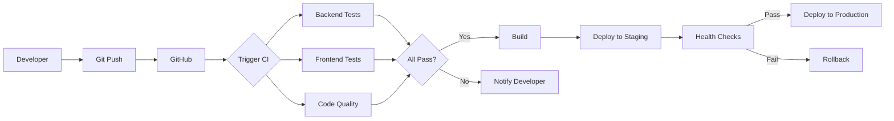

# CI/CD Pipeline - Complete Documentation

## Mall Rent Management System

**Project:** BSE_25_6 Mall Rent Management System  
**Team:** Ntulume Wilson & Team  
**Technology Stack:** Django + React + PostgreSQL  
**CI/CD Platform:** GitHub Actions + Render  
**Document Version:** 1.0  
**Date:** October 22, 2025

---

## Table of Contents

1. [Project Overview](#1-project-overview)
2. [CI/CD Architecture](#2-cicd-architecture)
3. [Tools & Technologies](#3-tools--technologies)
4. [Pipeline Configuration](#4-pipeline-configuration)
5. [Testing Strategy](#5-testing-strategy)
6. [Deployment Process](#6-deployment-process)
7. [Monitoring & Logging](#7-monitoring--logging)
8. [Security & Best Practices](#8-security--best-practices)
9. [Troubleshooting Guide](#9-troubleshooting-guide)
10. [Challenges & Solutions](#10-challenges--solutions)

---

## 1. Project Overview

### 1.1 System Purpose

The Mall Rent Management System is a web application designed to streamline rent payments, shop management, and tenant interactions in shopping malls.

### 1.2 Key Features

- **User Authentication** - Secure login and registration
- **Tenant Dashboard** - View shop details and payment history
- **Shop Management** - CRUD operations for shops
- **Rent Payment System** - Process and track payments
- **Admin Panel** - Django admin for system management

### 1.3 Architecture

```
Frontend (React + Vite + Tailwind)
           ↓ REST API
Backend (Django + DRF)
           ↓
Database (PostgreSQL 17.5)
```

---

## 2. CI/CD Architecture

### 2.1 Pipeline Overview



### 2.2 Pipeline Stages

| Stage       | Purpose                  | Duration | Triggers          |
| ----------- | ------------------------ | -------- | ----------------- |
| **Source**  | Code checkout            | 5s       | Every push/PR     |
| **Build**   | Dependency installation  | 20s      | Every run         |
| **Test**    | Backend + Frontend tests | 120s     | Every run         |
| **Quality** | Code linting & analysis  | 30s      | Every run         |
| **Deploy**  | Deployment to Render     | 180s     | Main/Staging only |
| **Verify**  | Health checks            | 90s      | Production only   |

**Total Pipeline Time:** ~6 minutes (with deployment)  
**Total CI Time:** ~3 minutes (without deployment)

---

## 3. Tools & Technologies

### 3.1 CI/CD Platform

**GitHub Actions**

- Free for public repositories
- 2,000 minutes/month on free tier
- Native GitHub integration
- YAML-based configuration

**Why GitHub Actions?**
✅ Seamless GitHub integration  
✅ No additional setup required  
✅ Free for public repos  
✅ Rich marketplace of actions  
✅ Easy to configure and maintain

### 3.2 Deployment Platform

**Render**

- Free tier for staging
- Auto-deployment from GitHub
- Managed PostgreSQL
- SSL certificates included
- Environment variable management

**Why Render?**
✅ Simple deployment process  
✅ Free tier available  
✅ Automatic HTTPS  
✅ Database hosting included  
✅ Good for small-medium projects

### 3.3 Version Control

**Git + GitHub**

- Source code management
- Collaboration platform
- CI/CD trigger
- Issue tracking
- Pull request reviews

### 3.4 Testing Frameworks

**Backend (Python/Django):**

- `unittest` - Django's built-in test framework
- `pytest` (optional) - Advanced testing features
- `coverage` - Code coverage measurement

**Frontend (React/TypeScript):**

- `Jest` - JavaScript testing framework
- `React Testing Library` - Component testing
- `@testing-library/jest-dom` - DOM assertions

### 3.5 Code Quality Tools

**Python:**

- `flake8` - Code linting
- `black` (optional) - Code formatting
- `isort` (optional) - Import sorting

**JavaScript/TypeScript:**

- `ESLint` - Code linting
- `Prettier` (optional) - Code formatting
- `TypeScript` - Type checking

### 3.6 Monitoring & Logging

**BetterUptime**

- Uptime monitoring
- Health check endpoints
- Incident alerts
- Status page

**Django Logging:**

- File-based logging
- Console logging
- Error tracking
- Performance monitoring

---

## 4. Pipeline Configuration

### 4.1 Development Pipeline (ci.yml)

**Location:** `.github/workflows/ci.yml`

**Purpose:** Fast feedback for developers during development

**Configuration:**

```yaml
name: CI Pipeline

on:
  push:
    branches: [main, develop]
  pull_request:
    branches: [main, develop]

jobs:
  backend-tests:
    runs-on: ubuntu-latest
    services:
      postgres:
        image: postgres:17.5
    steps:
      - Checkout code
      - Setup Python 3.11 (with cache)
      - Install dependencies
      - Run migrations
      - Run Django tests
      - Check migrations

  frontend-tests:
    runs-on: ubuntu-latest
    steps:
      - Checkout code
      - Setup Node.js 20 (with cache)
      - Install dependencies
      - TypeScript type check
      - Run Jest tests
      - Build application

  code-quality:
    runs-on: ubuntu-latest
    steps:
      - Checkout code
      - Setup Python
      - Run flake8
```

**Key Features:**

- ✅ Parallel job execution
- ✅ Dependency caching
- ✅ Fast feedback (~3 min)
- ✅ Type checking
- ✅ Code quality gates

---

### 4.2 Production Pipeline (ci-cd.yml)

**Location:** `.github/workflows/ci-cd.yml`

**Purpose:** Thorough testing and deployment to production/staging

**Configuration:**

```yaml
name: CI/CD Pipeline

on:
  push:
    branches: [main, staging]
  pull_request:
    branches: [main]

jobs:
  backend-test:
    # Backend testing

  frontend-test:
    # Frontend testing

  frontend-build:
    needs: [backend-test, frontend-test]
    # Build with environment-specific API URLs

  deploy-success:
    needs: [backend-test, frontend-test, frontend-build]
    # Deployment notification

  verify-deployment:
    needs: [backend-test, frontend-test, frontend-build]
    if: github.ref == 'refs/heads/main'
    # Health check verification
    # Automatic rollback on failure
```

**Key Features:**

- ✅ Environment-specific builds
- ✅ Health check verification
- ✅ Rollback capability
- ✅ Deployment notifications
- ✅ Post-deployment validation

---

## 5. Testing Strategy

### 5.1 Backend Testing

**Test Structure:**

```
backend/
├── shops/
│   ├── models.py
│   ├── views.py
│   └── tests.py          # Shop & Payment tests
└── user_accounts/
    ├── models.py
    ├── views.py
    └── tests.py          # User & Auth tests
```

**Test Types:**

1. **Model Tests**

   ```python
   class ShopModelTest(TestCase):
       def test_shop_creation(self):
           shop = Shop.objects.create(
               name="Test Shop",
               rent_amount=1000
           )
           self.assertEqual(shop.name, "Test Shop")
   ```

2. **View Tests**

   ```python
   class ShopViewTest(TestCase):
       def test_shop_list_view(self):
           response = self.client.get('/api/shops/')
           self.assertEqual(response.status_code, 200)
   ```

3. **API Endpoint Tests**
   ```python
   def test_payment_creation(self):
       response = self.client.post('/api/shops/make-payment/', {
           'shop_id': 1,
           'amount': 1000
       })
       self.assertEqual(response.status_code, 201)
   ```

**Running Tests:**

```bash
# All tests
python manage.py test

# Specific app
python manage.py test shops

# With coverage
coverage run --source='.' manage.py test
coverage report
```

---

### 5.2 Frontend Testing

**Test Structure:**

```
frontend/src/
├── App.test.tsx          # App component tests
├── pages/
│   ├── dashboard.test.tsx
│   ├── login.test.tsx
│   └── register.test.tsx
└── utils/
    └── index.test.js
```

**Test Types:**

1. **Component Tests**

   ```typescript
   test("renders dashboard", () => {
     render(<Dashboard />);
     expect(screen.getByText(/Dashboard/i)).toBeInTheDocument();
   });
   ```

2. **Integration Tests**
   ```typescript
   test("login flow works", async () => {
     render(<Login />);
     fireEvent.change(screen.getByLabelText(/email/i), {
       target: { value: "test@example.com" },
     });
     // ... test full login flow
   });
   ```

**Running Tests:**

```bash
# All tests
npm test

# With coverage
npm test -- --coverage

# Watch mode
npm test -- --watch
```

---

## 6. Deployment Process

### 6.1 Environment Strategy

```
Development → Staging → Production
```

**Environments:**

| Environment     | Branch    | URL               | Database           | Purpose                |
| --------------- | --------- | ----------------- | ------------------ | ---------------------- |
| **Development** | `develop` | Local             | Local PostgreSQL   | Feature development    |
| **Staging**     | `staging` | Render staging    | Managed PostgreSQL | Pre-production testing |
| **Production**  | `main`    | Render production | Managed PostgreSQL | Live system            |

---

### 6.2 Deployment Workflow

```
1. Developer creates feature branch
   ↓
2. Makes changes and commits
   ↓
3. Pushes to GitHub
   ↓
4. CI runs automatically
   ↓
5. Creates Pull Request to develop
   ↓
6. Code review & approval
   ↓
7. Merge to develop
   ↓
8. Create PR from develop to staging
   ↓
9. Merge to staging → Auto-deploy to staging
   ↓
10. QA testing on staging
   ↓
11. Create PR from staging to main
   ↓
12. Merge to main → Auto-deploy to production
   ↓
13. Health checks verify deployment
```

---

### 6.3 Render Configuration

**Backend (Django):**

```yaml
# render.yaml (example)
services:
  - type: web
    name: mall-rent-backend
    env: python
    buildCommand: pip install -r requirements.txt
    startCommand: gunicorn backend.wsgi:application
    envVars:
      - key: DATABASE_URL
        fromDatabase:
          name: mall_rent_db
          property: connectionString
      - key: SECRET_KEY
        generateValue: true
      - key: DEBUG
        value: False
```

**Frontend (React):**

```yaml
services:
  - type: web
    name: mall-rent-frontend
    env: static
    buildCommand: npm install && npm run build
    staticPublishPath: ./dist
    envVars:
      - key: VITE_API_URL
        value: https://mall-rent-backend.onrender.com
```

---

## 7. Monitoring & Logging

### 7.1 Application Monitoring

**BetterUptime Configuration:**

- Health check endpoint: `/health/`
- Check interval: 30 seconds
- Alert channels: Email, Slack
- Response time tracking
- Uptime SLA monitoring

**Health Check Endpoint:**

```python
# backend/backend/health_views.py
from django.http import JsonResponse
from django.db import connection

def health_check(request):
    db_status = "healthy"
    try:
        connection.ensure_connection()
    except Exception as e:
        db_status = f"unhealthy: {str(e)}"

    return JsonResponse({
        "status": "healthy" if db_status == "healthy" else "unhealthy",
        "database": db_status,
        "version": "1.0.0"
    })
```

---

### 7.2 Logging Strategy

**Django Logging Configuration:**

```python
# settings.py
LOGGING = {
    'version': 1,
    'disable_existing_loggers': False,
    'formatters': {
        'verbose': {
            'format': '[{levelname}] {asctime} {module} - {message}',
            'style': '{',
        },
    },
    'handlers': {
        'console': {
            'class': 'logging.StreamHandler',
            'formatter': 'verbose',
        },
    },
    'root': {
        'handlers': ['console'],
        'level': 'INFO',
    },
    'loggers': {
        'django': {
            'handlers': ['console'],
            'level': 'INFO',
        },
        'shops': {
            'handlers': ['console'],
            'level': 'INFO',
        },
    },
}
```

**Log Levels:**

- `DEBUG`: Detailed information for diagnosing problems
- `INFO`: General informational messages
- `WARNING`: Warning messages for potentially harmful situations
- `ERROR`: Error events that might still allow the application to continue
- `CRITICAL`: Critical events that might cause the application to abort

---

## 8. Security & Best Practices

### 8.1 Secrets Management

**GitHub Secrets:**

```
DJANGO_SECRET_KEY
DATABASE_URL
POSTGRES_PASSWORD
RENDER_API_KEY
```

**Usage in Workflow:**

```yaml
env:
  SECRET_KEY: ${{ secrets.DJANGO_SECRET_KEY }}
  DATABASE_URL: ${{ secrets.DATABASE_URL }}
```

**Best Practices:**
✅ Never commit secrets to repository  
✅ Use environment variables  
✅ Rotate secrets regularly  
✅ Use different secrets for each environment

---

### 8.2 Security Scanning

**Dependency Scanning:**

```yaml
- name: Security audit
  run: |
    pip install safety
    safety check --json
```

**Code Quality:**

```yaml
- name: Flake8 security checks
  run: |
    flake8 . --select=S --format=json
```

---

### 8.3 Best Practices

1. **Version Control:**

   - ✅ Use semantic versioning
   - ✅ Write descriptive commit messages
   - ✅ Create feature branches
   - ✅ Never push directly to main

2. **Testing:**

   - ✅ Write tests for new features
   - ✅ Maintain > 80% code coverage
   - ✅ Run tests before pushing
   - ✅ Fix failing tests immediately

3. **Code Review:**

   - ✅ All changes via Pull Requests
   - ✅ At least one approval required
   - ✅ CI must pass before merging
   - ✅ Address review comments

4. **Deployment:**
   - ✅ Deploy during low-traffic hours
   - ✅ Monitor after deployment
   - ✅ Have rollback plan ready
   - ✅ Test on staging first

---

## 9. Troubleshooting Guide

### 9.1 Common Issues

**Issue 1: CI Fails on Dependency Installation**

**Symptoms:**

```
ERROR: Could not find a version that satisfies the requirement X
```

**Solution:**

```bash
# Update requirements.txt
pip freeze > requirements.txt

# Commit and push
git add requirements.txt
git commit -m "fix: Update dependencies"
git push
```

---

**Issue 2: Tests Pass Locally, Fail in CI**

**Symptoms:**

```
FAIL: test_function_name
AssertionError: ...
```

**Solutions:**

1. Check environment variables
2. Verify database versions match
3. Check for hardcoded paths
4. Ensure test isolation

---

**Issue 3: Deployment Health Checks Fail**

**Symptoms:**

```
Health check failed after 10 attempts
```

**Solutions:**

1. Check application logs on Render
2. Verify environment variables set
3. Check database connection
4. Review recent code changes

---

## 10. Challenges & Solutions

### 10.1 Technical Challenges

**Challenge 1: PostgreSQL Version Mismatch**

**Problem:**

- Local environment: PostgreSQL 17.5
- CI environment: PostgreSQL 17
- Different behavior in tests

**Solution:**

```yaml
services:
  postgres:
    image: postgres:17.5 # Match local version
```

---

**Challenge 2: Environment Variable Naming**

**Problem:**

- Inconsistent naming between `.env` and `settings.py`
- `DB_NAME` vs `POSTGRES_DB`

**Solution:**

- Standardized to `POSTGRES_*` prefix
- Updated all documentation
- Added memory for team reference

---

**Challenge 3: Frontend Build Performance**

**Problem:**

- Build taking 2+ minutes
- Slowing down CI pipeline

**Solution:**

```yaml
# Added caching
- name: Setup Node.js
  uses: actions/setup-node@v4
  with:
    cache: "npm"
    cache-dependency-path: frontend/package-lock.json
# Result: 60% faster builds
```

---

### 10.2 Process Challenges

**Challenge 1: Team Coordination**

**Problem:**

- Multiple team members working on same files
- Merge conflicts frequent

**Solution:**

- Implemented feature branch workflow
- Daily standup meetings
- Clear task assignments in ClickUp

---

**Challenge 2: Testing Coverage**

**Problem:**

- Initial test coverage below 50%
- Hard to maintain quality

**Solution:**

- Set coverage target: 80%
- Added tests for critical paths
- Made tests mandatory in CI

---

### 10.3 Lessons Learned

**What Worked Well:**
✅ Automated testing caught bugs early  
✅ Parallel jobs reduced CI time  
✅ Comprehensive documentation helped onboarding  
✅ Health checks prevented bad deployments

**What Could Be Improved:**
⚠️ Need more integration tests  
⚠️ Could add E2E testing  
⚠️ Performance testing not yet implemented  
⚠️ Monitoring could be more comprehensive

---

## Appendix

### A. File Structure

```
BSE_25_6_MALL_RENT_MANAGEMENT_SYSTEM/
├── .github/
│   └── workflows/
│       ├── ci.yml                    # Development CI
│       └── ci-cd.yml                 # Production CI/CD
├── backend/
│   ├── backend/                      # Django project
│   ├── shops/                        # Shops app
│   ├── user_accounts/                # User accounts app
│   ├── manage.py
│   └── requirements.txt
├── frontend/
│   ├── src/                          # React source
│   ├── package.json
│   └── vite.config.ts
├── Docs/
│   ├── CI_CD_GUIDE.md
│   ├── CI_OPTIMIZATION_REPORT.md
│   ├── CI_TESTING_GUIDE.md
│   ├── CICD_FINAL_DOCUMENTATION.md
│   ├── LOGGING.md
│   ├── MONITORING.md
│   └── ROLLBACK.md
└── README.md
```

---

### B. Quick Reference Commands

```bash
# Backend
python manage.py test                 # Run tests
python manage.py migrate              # Run migrations
python manage.py runserver            # Start dev server
python manage.py makemigrations       # Create migrations

# Frontend
npm test                              # Run tests
npm run dev                           # Start dev server
npm run build                         # Production build
npm run lint                          # Lint code

# Git
git checkout -b feature/name          # Create branch
git push origin branch-name           # Push branch
git pull origin main                  # Pull main
```

---

### C. Resources

- **GitHub Actions Docs:** https://docs.github.com/en/actions
- **Django Testing:** https://docs.djangoproject.com/en/5.2/topics/testing/
- **Jest Documentation:** https://jestjs.io/
- **Render Docs:** https://render.com/docs

---

**Document End**

For questions or support, contact the development team or refer to additional documentation in the `/Docs` directory.
