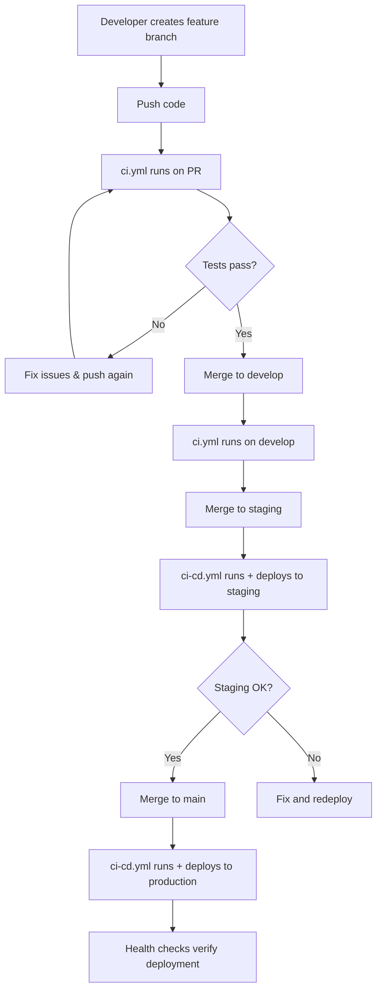

# CI Pipeline Comparison - Your Project

## You Now Have TWO CI Configurations!

### 1. **`ci-cd.yml`** (Existing - Production-focused)

### 2. **`ci.yml`** (New - Development-focused)

---

## Comparison Table

| Feature                     | `ci-cd.yml` (Existing)          | `ci.yml` (New)                   |
| --------------------------- | ------------------------------- | -------------------------------- |
| **Purpose**                 | Production & Staging deployment | Development testing              |
| **Triggers**                | `main`, `staging` branches      | `main`, `develop` branches + PRs |
| **Backend Tests**           | ✅ Yes                          | ✅ Yes                           |
| **Frontend Tests**          | ✅ Yes                          | ✅ Yes                           |
| **Build Step**              | ✅ Yes (with prod/staging URLs) | ✅ Yes                           |
| **Deployment Verification** | ✅ Yes (health checks)          | ❌ No                            |
| **Code Quality Checks**     | ❌ No                           | ✅ Yes (flake8)                  |
| **Migration Checks**        | ❌ No                           | ✅ Yes                           |
| **PostgreSQL Version**      | 17 (generic)                    | 17.5 (specific)                  |
| **Database Credentials**    | Generic test DB                 | Matches your local setup         |

---

## Recommendation: Use Both!

### **Use `ci-cd.yml` for:**

- ✅ Production deployments (main branch)
- ✅ Staging deployments (staging branch)
- ✅ Deployment health verification
- ✅ Final pre-production checks

### **Use `ci.yml` for:**

- ✅ Daily development work
- ✅ Pull request validation
- ✅ Feature branch testing
- ✅ Code quality enforcement

---

## Suggested Workflow



---

## Option 1: Keep Both (Recommended)

Rename and organize them for clarity:

```bash
.github/workflows/
├── ci.yml              # Development testing (all branches & PRs)
└── ci-cd.yml           # Production deployment (main & staging only)
```

**Benefits:**

- Faster feedback on PRs (ci.yml)
- Production safety checks (ci-cd.yml)
- Better separation of concerns

---

## Option 2: Merge Into One (Simpler)

Combine both into a single comprehensive pipeline.

**Benefits:**

- Single source of truth
- Easier to maintain
- Less confusion

**Drawbacks:**

- More complex configuration
- Longer CI runs for simple PRs

---

## Option 3: Use Only ci-cd.yml (Current State)

Just delete the new `ci.yml` and stick with what you have.

**Benefits:**

- Already configured for Render deployment
- Includes health checks
- Simpler for small teams

**Drawbacks:**

- Missing code quality checks
- Missing migration validation
- Only runs on main/staging (not on PRs to develop)

---

## My Recommendation: **Keep Both with Modifications**

Modify `ci.yml` to run on feature branches and PRs to `develop`, while keeping `ci-cd.yml` for production deployments.

---

## Updated Configuration Strategy

### **ci.yml** - Development Pipeline

```yaml
on:
  pull_request:
    branches: [main, develop]
  push:
    branches: [develop, "feature/**"]
```

**Purpose:** Quick validation for developers

### **ci-cd.yml** - Production Pipeline

```yaml
on:
  push:
    branches: [main, staging]
  pull_request:
    branches: [main]
```

**Purpose:** Deployment and production verification

---

## What Should You Do Right Now?

### **Scenario A: Your Team Uses Feature Branches**

✅ **Keep both pipelines**

1. Use `ci.yml` for rapid PR feedback
2. Use `ci-cd.yml` for production deployments
3. Update triggers to avoid overlap

### **Scenario B: Your Team Pushes Directly to Main**

⚠️ **Not recommended, but if you do:**

1. Delete `ci.yml`
2. Keep `ci-cd.yml` only
3. Add code quality checks to `ci-cd.yml`

### **Scenario C: You Want Maximum Safety**

🔒 **Merge both into one comprehensive pipeline**

Combine features:

- Code quality checks from `ci.yml`
- Deployment verification from `ci-cd.yml`
- Run everything on all branches

---

## Next Steps

I recommend **Option 1** (keep both). Here's what to do:

1. **Modify ci.yml** to avoid conflicts:

```yaml
on:
  pull_request:
    branches: [develop] # Only PRs to develop
  push:
    branches: [develop] # Only develop branch pushes
```

2. **Keep ci-cd.yml as-is** for production
3. **Document the strategy** in your team README
4. **Test both pipelines** with small commits

Would you like me to:

- **A)** Modify `ci.yml` to work alongside `ci-cd.yml`
- **B)** Delete `ci.yml` and enhance `ci-cd.yml` instead
- **C)** Merge both into one comprehensive pipeline

Let me know your preference! 🚀
